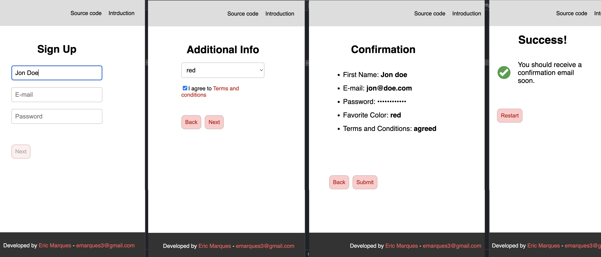

# Upgrade Challenge - Eric Marques' Solution

The solution I adopted splits the code in three main pieces (folders):

- app
- domains
- pages

The main goal for this is to separate the concerns. With that, we ensure things will be decoupled and abstract. For example, if one day a certain API fetching library is replaced, a hook code tha consumes it won't likely be affected, nor it'd need to "know" how it behaves. All it cares is how to request stuff, and how to receive them.

## App

The app is responsible for the general app behavior. It handles things like:

- Defining API calls mechanisms
- Structuring the routes
- Defining the global state
- Providing test tools
- Setting global/default styles

> If we were using GraphQL, this is where things such as Apollo configuration could be placed.

### API

That's where the implementation for API requests lives. It may provide different tools and techniques, using different libraries. It makes things abstract for the consumer, as they don't need to know how it works internally. In other words, at this moment it's using `fetch`, but it could be changed to `axios` for example. If that was the case, this layer would ideally make it seamless to the consumer.

### Routes

Besides being responsible for defining the router `JSX` code, it's also responsible for grouping/combining all routes available in the app. So whenever someone creates a new `/pages/SomePage/route.js`, it needs to be added to this array so the app will know it's a valid one.

### Store

Basically, it's where the reducers are combined. It doesn't know about each reducer's domain logic, it simply collects them and make them available to the app. The reducers implementations live in each `domain/some_domain/data/store`.

### Test

As I'm using Redux, I needed a way to mock the components with valid provider data. In order to do so, I created a `renderWithStore` function which takes the UI component and an optional set of configuration. If the configuration is passed, it will override the default values. This way I ensure the components will be tested as if they're actually consuming valid store data.

### UI

For now it simply contains the default styles, but it's a good place for generic and agnostic helpers (vanilla javascript stuff).

## Domains

That's where most of the business logic lives. It controls how the app behaves in a deeper level. Each domain may contain the folders `data` and `experience`.

### Data

Controls how the "non-UI" pieces work. It contains things like:

- API calls definitions
- hooks *
- state management (store), with actions, reducers, selectors, etc.
- testing (mostly providing Factories at the moment)

**_hooks_**: the idea is to centralize the main logic inside them. Data manipulation/validation, store updates, dispatching actions, initiating API calls, that's the place for it. And in the end, they return whatever may be useful for who's calling them. This helps avoiding heavier logic living inside the UI components, decreasing the cognitive load needed to understand their code too.

> If we were using GraphQL, this is where queries and mutations could be placed.

### Experience

Responsible for the UI code (components). Each component has its own `JSX` code, along with its styles (using `styled-components`) and unit test file.

## Pages

They represent the different pages/steps users will go through. Each one is responsible for defining its own HTML structure, style and its route (path). These paths are then combined in the `app/routes` folder.

They may or may not contain a certain amount of logic, specially if it's about "non-business" rules, simple navigation or basic UI stuff. But ideally, if a piece of logic is domain-heavier, it should be moved to the `domains` folder.

As they're pretty static, they're a good spot for snapshot tests.

## Notes

### Libraries

- `redux`: no strong feelings about the decision, just decided to go with this approach as I'm pretty familiar with it, and I already have some templates on my GitHub.
  - `reselect`: just making my life easier to grab things from the store.
  - `redux-actions`: helping me dispatch actions in a quick and structured way.
- `styled-components`: probably the styling library I'm most comfortable with.
- `react-router-dom`: simple solution to navigate through different URLs.
- `prettier`: I'm used with this style of code, so I reused some preset configs I had (along with `eslint` config)
- `faker`: no strong feelings either, just a way to have mocked data instead of hard coding them on tests.
- `@testing-library/react` and `jest`: the ones I'm used to use.
- `react-helmet`: just to place page titles in each `Page` file.

### Tests

I added a few unit tests, just to show possible approaches to testing. I didn't think of covering every single file, for the time being.

When it comes to mocking data, besides using `faker`, I used the Factory pattern to generate mocked data. This way, the factory becomes responsible for controlling how the data should be shaped, making it seamless to the rest of the test code. It also allows for custom data to be passed, meaning it will override the default ones from the factory.

### Validation

I kept the validations pretty simple:

- Required fields: for the time being, instead of showing red banners or messages, I simply disabled the "next" buttons when something is missing or off. So for example, as first name is required, the "next" button from the first step will only be available when it's filled with something other than empty. I'm also checking if the colors dropdown and the "I agree with terms" checkbox are valid, otherwise the user can't proceed. Which means the easiest way to see the error page in the end is by filling the name field with `Error` (existing logic from `server.js`).
- Fields with specific rules: the only one I used this was the email one, adding a simple regex to the `isValidEmail` function.
- Password: I didn't add any "minimum complexity requirements" for this test sake.

Having a better experience could be achieved by leveraging existing libraries that already handle validation, but I thought it wasn't this test focus.

### Navigation

This logic was kept pretty simple, as I didn't overthink it by creating complex navigation data structures, which could control the users steps and whatnot. I thought that was not the focus of this test. This means that if you access the 2nd step route straight (`/more-info`), you will be able to proceed to the final step and submit, even though the 1st step info is empty. I'm aware of this design limitation, which could be prevented with such extra work on the navigation logic.

All I did was in the UI end, centralizing the components, reusing the `back|next` buttons.

### Caching

When it comes to caching, I'm simply using the native `fetch` cache, which will prefer reusing it when available (`{ cache: 'force-cache' }`). That means on the 2nd step, you should only see the loading spinner once. That's the most basic approach, but I left some coments on the API requests code, which are good candidates as to where cache logic could be placed. It'd depend on different factors, but basically it could either go inside `app/api` if we wanted to control it globally (or at least its core logic); or it could go inside each domains' API related code (where it consumes the basic tools from `app`). It could be `localStorage`, `cookies`, and others. But for this test I just pointed out how I could do it and where, keeping in mind the separation of concerns mindset.

### Shell Domain

It's a place for more pure HTML/JSX code, such as the main `PageWrapper`, which uses the `Footer`, `Header`, ensuring the main website's visual structure is properly set.

It also contains generic reusable components, such as `Loading`, `Title`, so on and so forth.

### Accessibility

I didn't do anything specific (set aria labels and other things), so I just ensured the user can navigate with the keyboard.